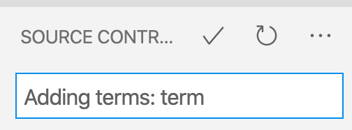
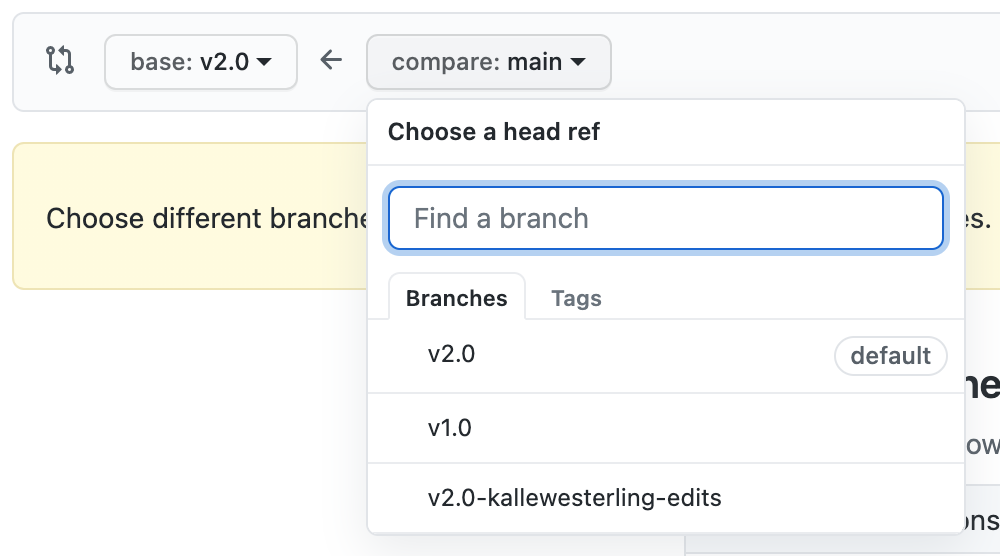
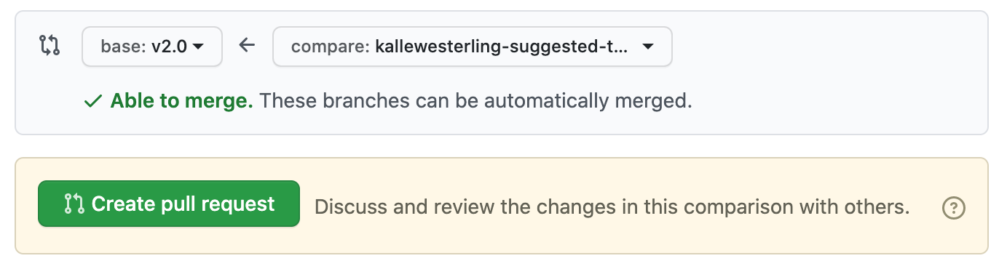
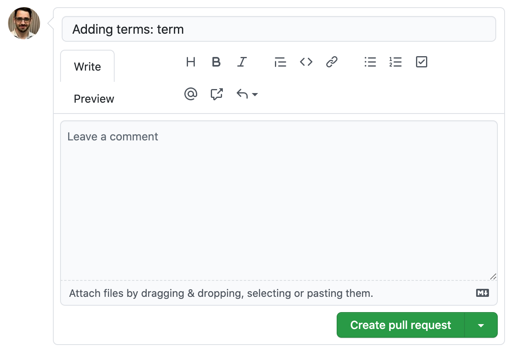

# Commit New Term to GitHub

## Step 1. Commit your changes and synchronize with GitHub.

Press the version control button in your menubar on the left (alternatively, you can choose `SCM` from the `View` menu).  

Next, hover over your newly added term file:

Then, press the `+` button to add the files to your commits. Once you press the `+` button, the file should move from the `Changes` section to the `Staged Changes` section. Once all your files with your terms are in the `Staged Changes` section, you are ready to move on.  

In the `Message` box above the list, type an instructive message, something along the lines of `Adding terms: <Term 1>, <Term 2>, <Term 3>`

Then, press the checkmark above the message box (<kbd>✓</kbd>). Alternatively, you can press <kbd>command</kbd> <kbd>enter</kbd>.

Next, you want to synchronize your commit(s) with GitHub, by pressing the icon next to your branch name. If it's your first time, you should press the little cloud with an arrow into it.

Otherwise, you should press two arrows forming a circle:

## Step 2. Add a pull request to the `v2.0` branch

Next, we will want to add a pull request to the `v2.0` branch, the current production branch for the DHRI Curriculum's glossary.

Navigate to GitHub's [Compare changes](https://github.com/DHRI-Curriculum/glossary/compare/v2.0...main) page.
   
Ensure that the `base` branch (the one you want to merge your changes _into_) is selected as `v2.0`:

On the `compare` side, you will then want to choose your own branch in the popup menu:

You should see a large, green button that says "Create pull request" and a green checkmark that says that you're able to merge:

Press the "Create pull request" button, and fill out the form that pops up with some important information. _Note: If you filled out the commit above with information about all the terms you added, that should already be the title of your request and this should be an easy step._ Once you're done, press the green "Create pull request" button at the bottom of the form.  

You're done. Once someone gets around to it, your changes might be merged into the repository.
