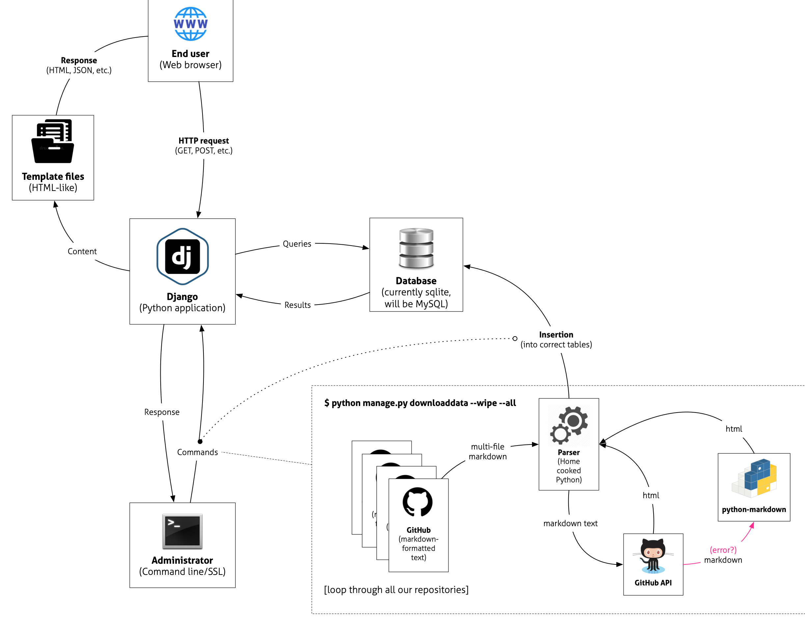

# Overview of the Django workflow

In order to explain the workflow of what happens in the application, here is a visual representation of the flow from the end user and the administrator end, and both of their interactions with the Django application.

When the **end user** sends a HTTP request to the server, **Django** (in reality, Django's `wsgi` application, but we will not get into that now) will handle the request, and use its internal settings to send appropriate queries to the **backend database**. In this version (and the previous one), the database backend is a MySQL database. The database will send back its results, and Django will send the response to its **template generator**, which will create the response (in HTML format, in most cases, to the end user).

On the **administrator**'s side, we can interact with django through the built-in `manage.py` command, via the command line. With our Django application comes a custom-built command that can run through Django's `manage.py`, and it's called `build`. The easiest way to run it, is to run `python manage.py build` (for more information about this command, see [Populate Database](2-populating-the-database.md)).

Once you run the `build` command, it will loop through all repositories, downloading all of the markdown files from respective repositories, and parse them, using a "home-cooked" Python script. The script converts markdown to HTML, as well, first trying to do so through [GitHub's REST API](https://docs.github.com/en/rest/reference/markdown) (via [PyGithub](https://github.com/PyGithub/PyGithub)) and, if that fails, using the [Python-Markdown](https://github.com/Python-Markdown/markdown) package, with some plug-ins.
