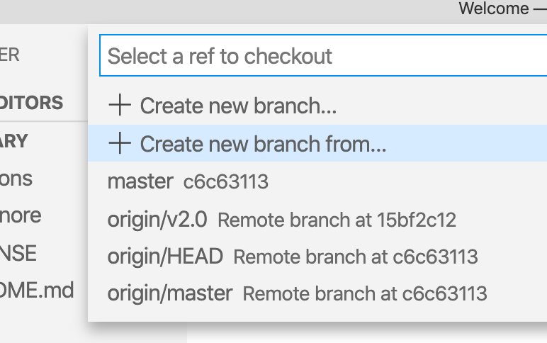
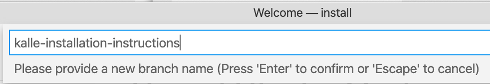
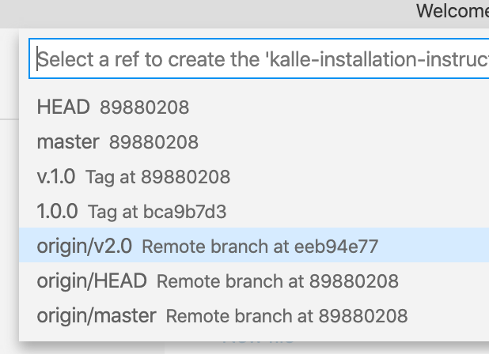
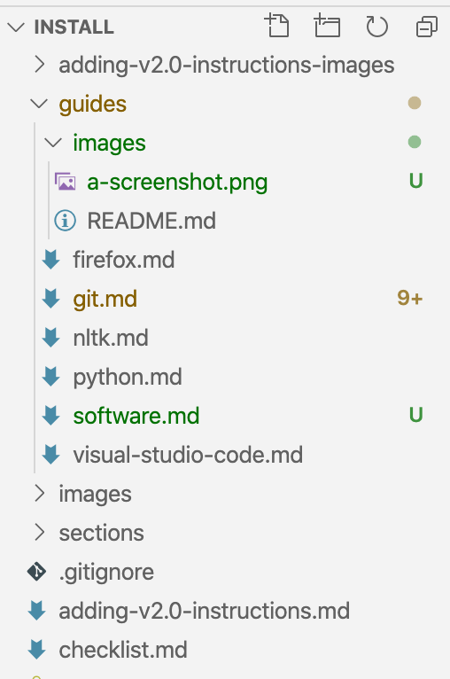

# Build a new installation instruction

In this tutorial, we will use VS Code but if you prefer, you can use any other editor or even command line tools.

## Step 1. Clone the repository.

1. Bring up the Command Palette (<kbd>command</kbd> <kbd>shift</kbd> <kbd>P</kbd>)

2. Type `git clone`

3. When asked to provide repository URL, paste `https://github.com/DHRI-Curriculum/install/` into the box.

4. VS Code will ask you where to save your local clone of the repository. Choose wherever you would like to have it.

5. When asked "Would you like to open the cloned repository?", press "Open in New Window" (to ensure no conflict with any other windows you may have open).

## Step 2. Create your own branch.
   
In the lower-left corner of the VS Code's window, click on the branch name that you are currently working on (likely "main"):


In the menu that pops up, select "Create new branch from...":



Next, provide a branch name for your new branch (following our [style guide](../style-guide/branches/branch-names.md), choose something along the lines of `v2.0-<your-username>-suggested-terms`). Then press <kbd>enter</kbd> to create the new branch:



You should then be asked to "Select a ref to create" in relation to your branch. In this example above, since our desired upstream is the `v2.0` branch, you will select `origin/v2.0`:



You should now be on your own branch of this repository. You can verify that you're on the correct branch by checking your lower-left corner that should have your branch name instead of the formerly active branch.


## Step 3. Add the installation instruction(s) you believe should be added to the `guides` folder

Before you start to add content to your editing branch, make sure you're adding instructions to the correct folder, `guides` inside the repository. The installation instructions should be in its own, separate `<software-name>.md` file. Keep the filename lowercase and replace spaces with '-'.

_Note that there is a template for [`term.md`](file-templates/guide.md) available to make the following easier to follow._

1. Add the image assigned to the installation instruction as the first line in the file with an absolute link to the image inside the repository's `_django-meta/header-images` folder:

    ```md
    
    ```

2. After the image, add the name of the software as a level 1 header. The markdown should now look like this:

    ```md
    

    # Git (and Git Bash)
    ```

3. Immediately following the software name, add the required section `## What it is` where you add a description of the software that this guide will install. Be specific as we consider following installation instructions to be part of the foundational skills that learners will acquire in the DHRI..

4. Under the `## Why we use it` header, add a description that follows the format below:

    ```md
    For the Digital Humanities Research Institute, we use <insert software here> because <insert reason why we use this software. If it is used instead of another one, explain why we have chosen this software.>
    ```

4. Under the two headings `## Installation instructions: macOS` and `## Installation instructions: Microsoft Windows` respectively, add installation instructions:

   - Each step should be added as a level 3 header (`###`) following this convention: `### Step 1: <Insert Step 1 Header>`
   - Each instruction step should follow this convention: A step should contain no more than one or two clicks/dragging files, or entering information into text boxes, unless there is, for example, a form where you may need to input multiple points of information in the same place.
   - Include a screenshot for each step - see below for example of how to insert it. If there are more complicated things to do, consider making a GIF. Make sure screenshots are up to date and added inside the [`guides/images`](https://github.com/DHRI-Curriculum/install/tree/v2.0/guides/images) directory.

Once you are done with _all of the installations instructions you would like to add_, your VS Code should look something like this:



Now you're ready to move on to the next step, [committing your changes to GitHub](commit.md).