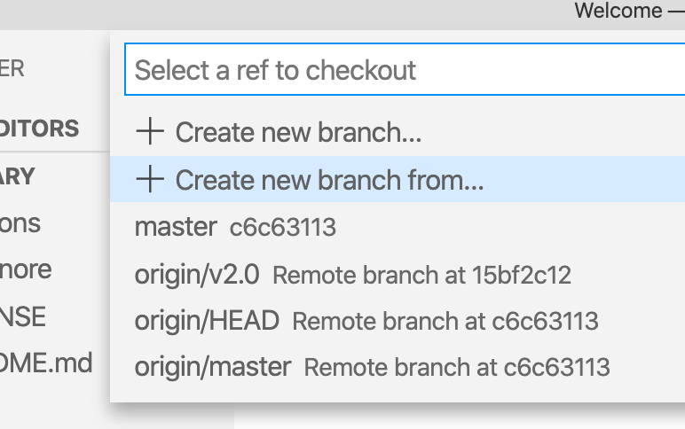

# Build a new term

In this tutorial, we will use VS Code but if you prefer, you can use any other editor or even command line tools.

## Step 1. Clone the repository.

1. Bring up the Command Palette (<kbd>command</kbd> <kbd>shift</kbd> <kbd>P</kbd>)

2. Type `git clone`

3. When asked to provide repository URL, paste `https://github.com/DHRI-Curriculum/glossary/` into the box.

4. VS Code will ask you where to save your local clone of the repository. Choose wherever you would like to have it.

5. When asked "Would you like to open the cloned repository?", press "Open in New Window" (to ensure no conflict with any other windows you may have open).

## Step 2. Create your own branch.

In the lower-left corner of the VS Code's window, click on the branch name that you are currently working on (likely "main"):

In the menu that pops up, select "Create new branch from...":

Next, provide a branch name for your new branch (following our [style guide](../style-guide/branches/branch-names.md), choose something along the lines of `v2.0-<your-username>-suggested-terms`). Then press <kbd>enter</kbd> to create the new branch:

You should then be asked to "Select a ref to create" in relation to your branch. In this example above, since our desired upstream is the `v2.0` branch, you will select `origin/v2.0`:

You should now be on your own branch of this repository. You can verify that you're on the correct branch by checking your lower-left corner that should have your branch name instead of the formerly active branch.

## Step 3. Add the term(s) you believe should be added to the `terms` folder

Before you start to add content to your editing branch, make sure you're adding terms to the correct folder, `terms` inside the repository. The term should be in its own, separate `<term>.md` file. Keep the filename lowercase and replace spaces with '-'.

_Note that there is a template for [`term.md`](file-templates/term.md) available to make the following easier to follow._

1. Add the term as the first header in the file (`# <term>`)

2. In the first paragraph after the first header, add the explanation of the term.

3. (Optional) Add a section `## Readings` where you add a bulletpoint for each _reading_ you think is valuable to grasp the term that you want to add to the glossary.

4. (Optional) Add a section `## Tutorials` where you add a bulletpoint for each _tutorial_ you think is valuable to grasp the term that you want to add to the glossary.

5. (Optional) Add a section `## Cheat sheets` where you add a bulletpoint for each _cheat sheet_ you think is good for the learner to know about to be able to understand the term.

Once you are done with _all of the terms you would like to add_, your VS Code should look something like this:

Now you're ready to move on to the next step, [committing your changes to GitHub](commit.md).